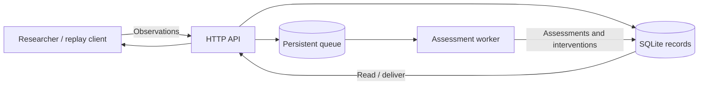

# normative-conformance for non-normative behavior

A research prototype for supporting moral self-regulation in conversation. It accepts recorded speech observations, checks one target speaker against fixed SQL models of undesired behavior, allows time for repair, and records intervention messages for a client to retrieve.

## Features

- Undesired-behavior and repair models, versioned.
- Asynchronous assessment, repair deadlines, and grouped intervention messages.
- Stored observations, assessment history, and links from interventions to evidence.
- Interactive API documentation and repeatable case replays.

**Stack:** Python 3.13, FastAPI, Pydantic, SQLModel, SQLite, Alembic, and persist-queue. Development uses uv, pytest/pytest-cov, Ruff, mypy, and pre-commit.

## Quick start

Prerequisites: Git, [uv](https://docs.astral.sh/uv/getting-started/installation/), and a shell. Run commands from the repository root. uv provisions the pinned Python version when needed.

1. Clone this repository using its **Code → HTTPS** URL, then enter the clone.
2. Install the locked environment: `uv sync --locked`.
3. Start the API: `uv run fastapi dev src/normative_conformance/main.py`.
4. Open [readiness](http://127.0.0.1:8000/health/ready). Expect `{"status":"ready"}`.
5. Open [interactive API docs](http://127.0.0.1:8000/docs) and follow the [user walkthrough](docs/user_guide.md).

Startup creates and migrates the database, seeds the models, and starts the worker. The default target is `speaker-2`. It is fixed at the database's first startup. Use a fresh database for the walkthrough. Configuration and storage paths are in [the deployment guide](docs/deployment_guide.md#configuration).

This prototype supports local research demonstrations. It has no authentication and has unresolved recovery defects. See [known issues](docs/known_issues.md) before using its results or deploying it.

## Documentation

| Read this | To |
|---|---|
| [User guide](docs/user_guide.md) | Submit observations, inspect results, and deliver interventions |
| [Developer guide](docs/developer_guide.md) | Understand the architecture, change code, and run tests |
| [API reference](docs/api.md) | Find endpoints, data formats, examples, and errors |
| [Useful commands](docs/commands.md) | Run, test, check, and replay the application |
| [Deployment guide](docs/deployment_guide.md) | Configure, start, verify, and maintain a local instance |
| [Known issues](docs/known_issues.md) | Check limitations, workarounds, and planned improvements |

The [QA report](docs/quality_assurance_report.md) records evaluation evidence.
