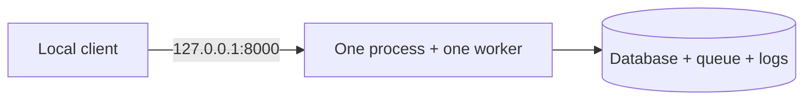

# Deployment guide

## 1. Configure and start

Prerequisites: a checkout, Git, [uv](https://docs.astral.sh/uv/getting-started/installation/), and writable local storage. uv provisions Python 3.13, which includes SQLite. Run commands in a Unix-like shell from the repository root.



### Configuration

Set environment variables or put the same names in `.env` at the repository root. Environment variables take precedence. Relative paths use the working directory. Keep that directory stable across restarts.

| Variable | Default | Purpose |
|---|---|---|
| `APP_DB_PATH` | `data/prototype.sqlite3` | Application SQLite file |
| `ASSESSMENT_QUEUE_PATH` | `data/assessment_queue` | Persistent queue directory |
| `LOG_DIR` | `data/logs` | JSONL log files, one per application start |
| `SUBJECT_SPEAKER_ID` | `speaker-2` | Nonempty ID without `/`. Used only on first database initialization |
| `INTERVENTION_WINDOW_US` | `2000000` | Positive grouping delay, in microseconds |
| `DEBUG` | `false` | Framework debug mode. Leave disabled for handoff |
| `APP_NAME` | `normative-conformance` | Application title |

From the reviewed checkout, install runtime dependencies, configure dedicated storage, and start one process with reload disabled:

```bash
uv sync --locked --no-dev
export APP_DB_PATH=data/research/app.sqlite3
export ASSESSMENT_QUEUE_PATH=data/research/queue
export LOG_DIR=data/research/logs
export SUBJECT_SPEAKER_ID=speaker-2
export INTERVENTION_WINDOW_US=2000000
export DEBUG=false
uv run --no-dev uvicorn normative_conformance.main:app \
  --host 127.0.0.1 --port 8000 --workers 1
```

Startup creates directories, applies migrations, initializes the subject, and validates the catalog. Invalid models stop startup. Each instance needs its own database and queue. Multiple processes sharing this storage are unsupported for this prototype.

## 2. Verify and operate

```bash
curl --fail http://127.0.0.1:8000/health/live
curl --fail http://127.0.0.1:8000/health/ready
curl --fail http://127.0.0.1:8000/api/v1/models
```

Expect `live`, `ready`, and a catalog with the undesired and repair models. Execute the [user walkthrough](user_guide.md) on a fresh acceptance instance: one accepted observation, one `harm_phrase` assessment, one pending intervention, then a sent intervention. Readiness checks availability. It does not prove that a particular task or intervention has completed.

### Diagnostics

Structured logs go to stdout and `$LOG_DIR/<UTC start time>.jsonl`. Use `event` and the case, observation, evaluation, or request IDs to correlate operations. Exception fields contain type names rather than exception messages. Transcripts are not included in application logs. Inspect API records to verify outcomes. Use the [error reference](api.md#errors) when readiness fails or an expected result is missing.
