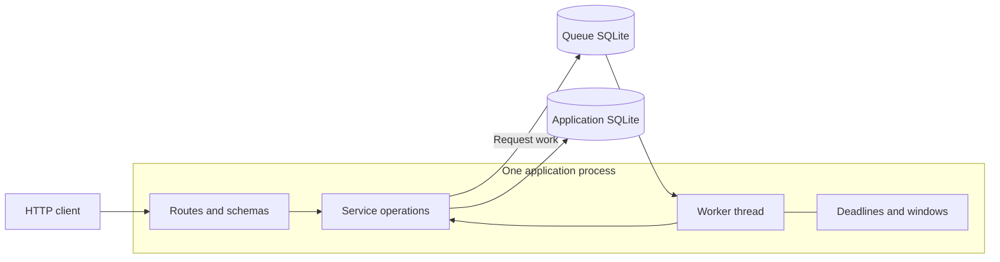
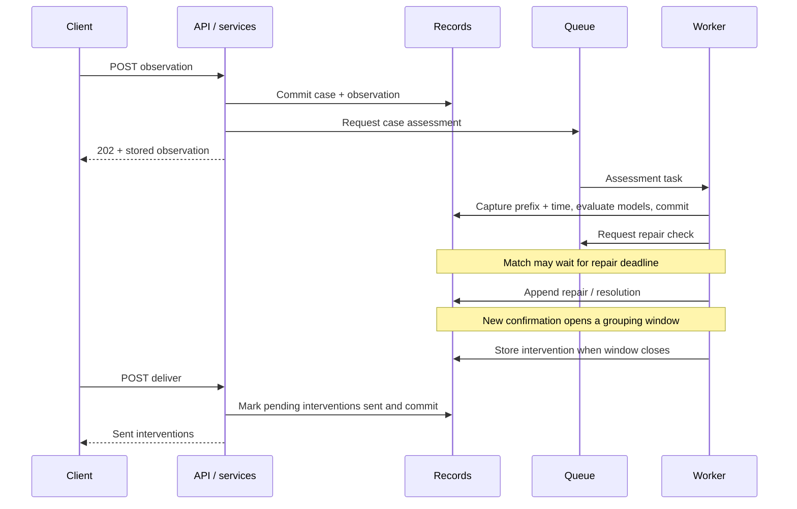
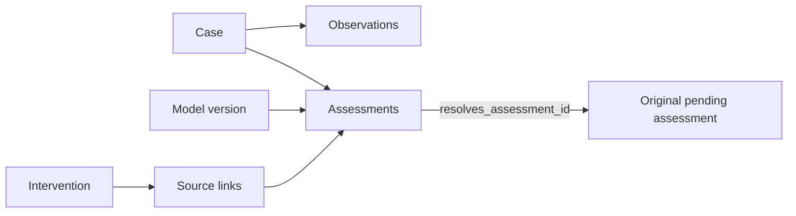

# Developer guide

This guide describes the current implementation.

## 1. Environment and architecture

Install Git and [uv](https://docs.astral.sh/uv/getting-started/installation/), clone the repository, and run from its root:

```bash
uv sync --locked
uv run pre-commit install
uv run fastapi dev src/normative_conformance/main.py
```

`.python-version` pins Python 3.13. `uv.lock` pins dependencies. The development server reloads on changes. Each reload restarts the worker. Use separate storage for experiments, as shown in the [user guide](user_guide.md). Readiness is `GET /health/ready`. The interactive API is `/docs`.



Routes validate input, supply dependencies, and return service results. Services own operations, including transaction boundaries and follow-up work. The scheduler coalesces waiting requests per case. After a task starts, new observations can queue a follow-up. Assessment and repair requests have separate waiting sets. One process owns the worker and its coordination state.

Startup configures logging, migrates storage, initializes the subject, validates every stored model, and starts the worker. Model validation checks the schema, rule execution against an empty case, and intervention-message coverage. The worker uses this validated catalog until restart.

## 2. Assessment and intervention flow



The sequence shows successful operation. A **202** confirms observation storage and a successful scheduling request, not assessment completion. If queueing fails after commit, **503 ENQUEUE_FAILED** carries `committed_observation`. A duplicate submission does not retry scheduling.

Each evaluation captures a case sequence and server time. Rules query that prefix. New arrivals belong to later evaluations. A matching undesired model creates `pending` with a deadline or `conformant` immediately when its allowance is null. No match creates no assessment. Reusing a pending match preserves its original deadline.

Repair timeliness uses server receipt time. A qualifying repair must arrive strictly before the deadline and remove the original match at its speech boundary. Resolution appends a linked `non-conformant` or `conformant` assessment. The original remains unchanged. A recognized repair also permits future detection after that boundary.

New undesired confirmations open one grouping window per case. At window close, one message is selected by an ordered policy table, and the intervention links all eligible unlinked confirmations since the window opened. The window batches work. Slow evaluation can include confirmations after its nominal end. The policy currently always authorizes a message.

## 3. Code and stored data

Paths below are relative to `src/normative_conformance/`.

| Location | Responsibility |
|---|---|
| `main.py`, `lifespan.py`, `config.py` | ASGI app, startup/shutdown, environment settings |
| `routes/`, `schemas/` | HTTP boundary and validated public contracts |
| `services/observation/` | Store and retrieve case observations |
| `services/model/`, `services/assessment/` | Evaluate SQL models and append results |
| `services/scheduler/` | Request coalescing, worker loop, repair and intervention timers |
| `services/intervention/`, `services/health/` | Create/deliver messages. Check readiness |
| `models/`, `database.py`, `queue.py` | SQLModel tables, transactions, persistent task queue |
| `migrations/` | Alembic environment and schema/catalog revisions |
| `logging.py`, `timestamps.py` | Structured diagnostics and UTC/microsecond conversion |



An assessment records its model version and evaluated prefix (`through_sequence`). The API reconstructs that prefix as `extent`. It is the evaluated history, not a minimal set of causal observations. Rule explanations record status and any repair observation IDs. SQLModel tables and database triggers enforce the stored invariants. Times are integer UTC microseconds in storage and timezone-aware timestamps at API boundaries.
