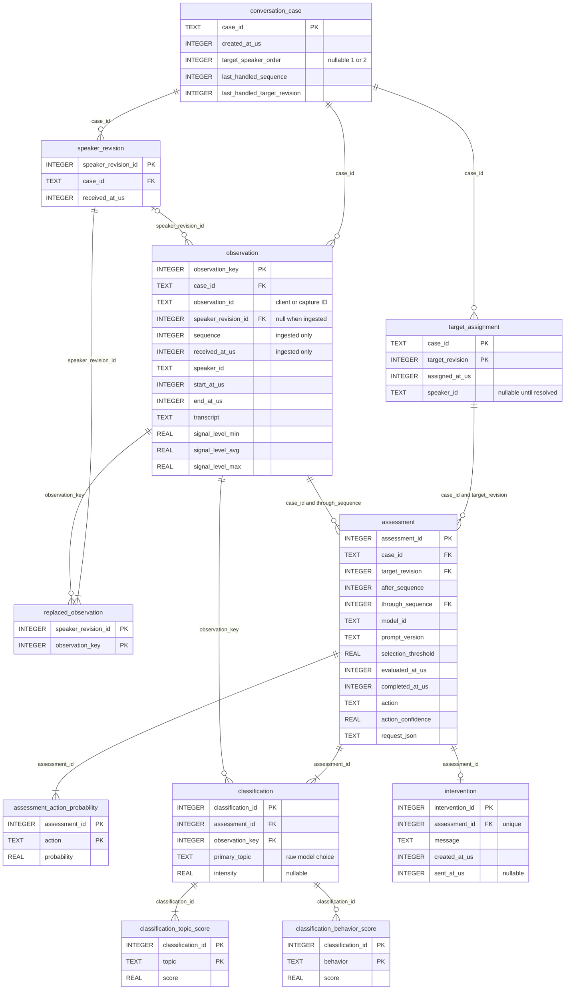

# Database schema

```mermaid
erDiagram
    conversation_case {
        TEXT case_id PK
        INTEGER created_at_us
        INTEGER target_speaker_order "nullable 1 or 2"
        INTEGER last_handled_sequence
        INTEGER last_handled_target_revision
    }
    target_assignment {
        TEXT case_id PK
        INTEGER target_revision PK
        INTEGER assigned_at_us
        TEXT speaker_id "nullable until resolved"
    }
    observation {
        INTEGER observation_key PK
        TEXT case_id FK
        TEXT observation_id "client or capture ID"
        INTEGER speaker_revision_id FK "null when ingested"
        INTEGER sequence "ingested only"
        INTEGER received_at_us "ingested only"
        TEXT speaker_id
        INTEGER start_at_us
        INTEGER end_at_us
        TEXT transcript
        REAL signal_level_min
        REAL signal_level_avg
        REAL signal_level_max
    }
    speaker_revision {
        INTEGER speaker_revision_id PK
        TEXT case_id FK
        INTEGER received_at_us
    }
    replaced_observation {
        INTEGER speaker_revision_id PK
        INTEGER observation_key PK
    }
    assessment {
        INTEGER assessment_id PK
        TEXT case_id FK
        INTEGER target_revision FK
        INTEGER after_sequence
        INTEGER through_sequence FK
        TEXT model_id
        TEXT prompt_version
        REAL selection_threshold
        INTEGER evaluated_at_us
        INTEGER completed_at_us
        TEXT action
        REAL action_confidence
        TEXT request_json
    }
    assessment_action_probability {
        INTEGER assessment_id PK
        TEXT action PK
        REAL probability
    }
    classification {
        INTEGER classification_id PK
        INTEGER assessment_id FK
        INTEGER observation_key FK
        TEXT primary_topic "raw model choice"
        REAL intensity "nullable"
    }
    classification_topic_score {
        INTEGER classification_id PK
        TEXT topic PK
        REAL score
    }
    classification_behavior_score {
        INTEGER classification_id PK
        TEXT behavior PK
        REAL score
    }
    intervention {
        INTEGER intervention_id PK
        INTEGER assessment_id FK "unique"
        TEXT message
        INTEGER created_at_us
        INTEGER sent_at_us "nullable"
    }
    conversation_case ||--o{ target_assignment : "case_id"
    conversation_case ||--o{ observation : "case_id"
    conversation_case ||--o{ speaker_revision : "case_id"
    speaker_revision ||--|{ replaced_observation : "speaker_revision_id"
    observation ||--o{ replaced_observation : "observation_key"
    speaker_revision |o--o{ observation : "speaker_revision_id"
    target_assignment ||--o{ assessment : "case_id and target_revision"
    observation ||--o{ assessment : "case_id and through_sequence"
    assessment ||--|{ assessment_action_probability : "assessment_id"
    assessment ||--|{ classification : "assessment_id"
    observation ||--o{ classification : "observation_key"
    classification ||--|{ classification_topic_score : "classification_id"
    classification ||--o{ classification_behavior_score : "classification_id"
    assessment ||--o| intervention : "assessment_id"
```
