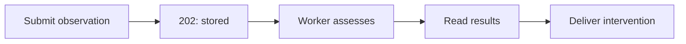
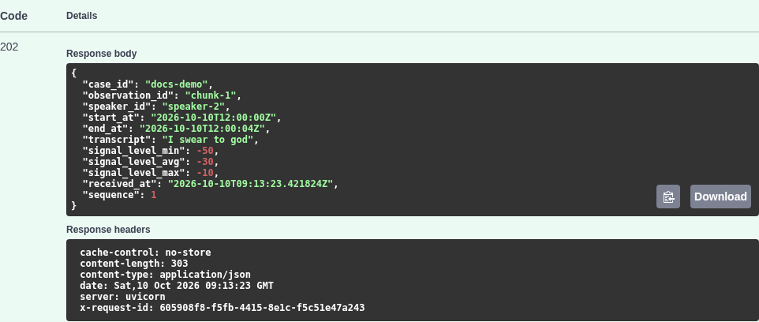
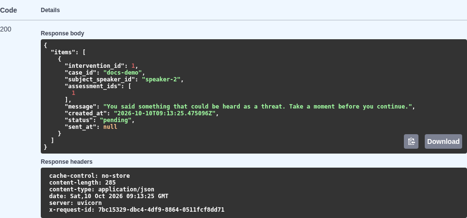

# User guide

For researchers replaying synthetic or recorded observations.

## 1. Set up and submit an observation

Install Git and [uv](https://docs.astral.sh/uv/getting-started/installation/), clone the repository, and open a shell in its root. uv installs the pinned Python 3.13. For a separate walkthrough database, run:

```bash
uv sync --locked
export APP_DB_PATH=data/walkthrough/app.sqlite3
export ASSESSMENT_QUEUE_PATH=data/walkthrough/queue
export LOG_DIR=data/walkthrough/logs
export SUBJECT_SPEAKER_ID=speaker-2
uv run fastapi dev src/normative_conformance/main.py
```

Use an unused storage directory for a new run. Keep this terminal open. Startup creates the storage and models automatically. Open [readiness](http://127.0.0.1:8000/health/ready). `{"status":"ready"}` means the database, queue, and worker are available. Open [API docs](http://127.0.0.1:8000/docs).



Expand **POST /api/v1/observations**, select **Try it out**, replace the request body with the JSON below, and select **Execute**. This synthetic phrase deliberately matches `harm_phrase`. The four-second duration and low signal levels avoid a loud-and-fast match.

```json
{
  "case_id": "docs-demo",
  "observation_id": "chunk-1",
  "speaker_id": "speaker-2",
  "start_at": "2026-10-10T12:00:00Z",
  "end_at": "2026-10-10T12:00:04Z",
  "transcript": "I swear to",
  "signal_level_min": -50,
  "signal_level_avg": -30,
  "signal_level_max": -10
}
```

Expect **202**, the submitted fields, `sequence: 1`, and a server `received_at` timestamp. Each observation ID must be unique within its case. For another run, use a new case ID or a new storage directory. Submitting this record twice gives **409**. The [API reference](api.md#observation-input) explains validation.

## 2. Inspect the stored results

An accepted observation is stored before assessment begins. In `/docs`, execute **GET /api/v1/cases/{case_id}/observations** with `case_id` set to `docs-demo`. It returns the submitted observation inside `items`.



*Actual response from the walkthrough. Server timestamps vary. Screenshots use port 8765 to keep the verification instance separate from normal development.*

Next execute **GET /api/v1/cases/{case_id}/assessments** with the same case ID. Refresh until `items` contains the `harm_phrase` assessment with `status: "conformant"`. There is no repair delay for this model. A successful request can initially return an empty list while the worker is catching up.

| Status | Meaning |
|---|---|
| `pending` | A model matched. Its repair period is still open |
| `conformant` | The observations match the named model. An undesired model can cause an intervention |
| `non-conformant` | A previously pending undesired match was repaired |
| `conflicted` | Reserved in the API. The current evaluator does not produce it |

**Conformant means a model match, not good behavior.** Repair models can also have conformant assessments. Read `model_id` and inspect that model with **GET /api/v1/models/{model_id}/versions/{version}**. `extent` identifies the evaluated case history. A resolution adds a new assessment whose `resolves_assessment_id` points to the original pending record.

For timing experiments, use the supplied replay cases:

```bash
uv run python scripts/send_observations.py scripts/cases/case-3.jsonl
```

This preserves recorded gaps. [The case manifest](../scripts/manifest.md) describes inputs and expected results. A fixed `--delay` changes receipt timing and can change whether a repair is timely. Keep each experiment's storage separate.

## 3. Read and deliver an intervention

Execute **GET /api/v1/interventions** with `case_id=docs-demo` and `status=pending`. Repeat until the item appears, normally after the two-second grouping window. Reading does not change its state.



Execute **POST /api/v1/interventions/deliver** with no body. The returned item has `status: "sent"` and a `sent_at` timestamp. A second delivery returns `{"items":[]}` when nothing else is pending. **Delivery takes all pending interventions across all cases.** Use it only on your isolated instance. To inspect without consuming, continue using GET. The API does not send audio, email, or another external notification.

### Troubleshooting

| Symptom | Action |
|---|---|
| Cannot connect | Keep the server terminal open. Confirm its host and port |
| 409 on submission | The case/observation pair exists. Inspect it or choose a new identity |
| 422 on submission | Check the response's `detail`. Supply timezone-aware times, end after start, and ordered signal levels |
| Empty results | Check readiness, target speaker, and model match. Allow assessment and repair/window delays |
| 503 | Follow the error-specific action in the [API reference](api.md#errors). Check [known issues](known_issues.md) |

**Why did changing `SUBJECT_SPEAKER_ID` do nothing?** The database retains the subject selected at first startup. Use new storage for a different experiment.
